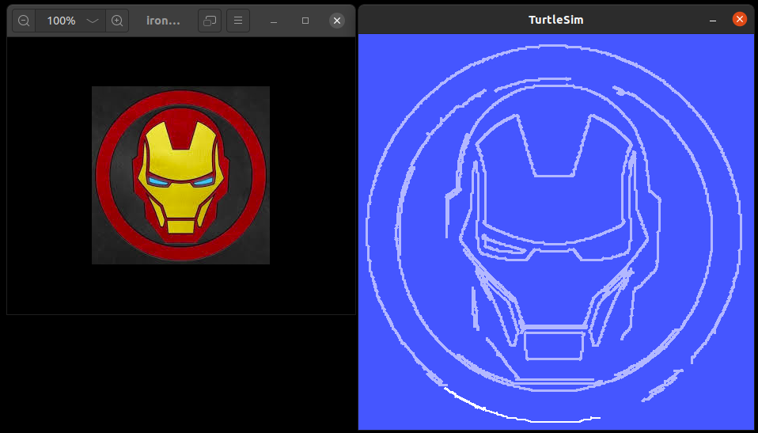
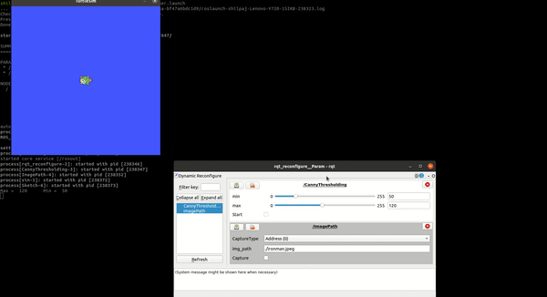
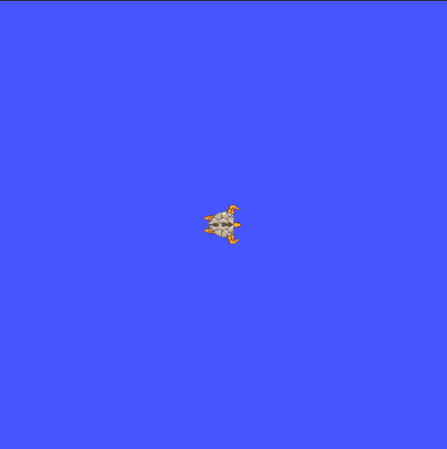
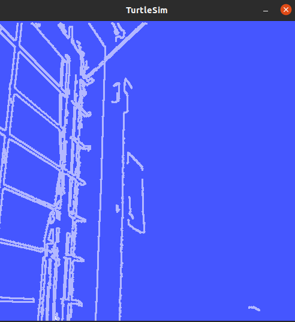

# Project: Turtle-Sketch


## Overview

- In this project, the image on the left is taken as input and the image on the right is obtained as output by using turtlesim




- The image on the left can be selected using it's path as well as can be directly taken from the camera

- The below videos show the project in action

  > Click on the below animations for full video

### Using an image

​                                                                     [](https://youtu.be/bBs16HXfasw)

### Using webcam 

​                                                                     [](https://youtu.be/nKCuhRvWfk4)


---


## Concepts Used

Following are the concepts used for this project:

- **Dynamic reconfigure**
  - To import  the image using path
  - To import the image using camera
  - To set thresholds for Canny edge detection 
- **ROS parameters** 
  - To set the values of threshold parameters
  - To fetch the  values of threshold parameters
- **ROS services** 
  - To spawn the turtles
  - To teleport the turtle
  - To set the status of a pen as - ON/OFF
  - To remove the turtles after sketch is completed
- **OpenCV**
  - To import image
  - To find the edges using Canny edge detection
  - To find the contours
- **Multi-processing** 
  - To spawn an army of turtles to draw the sketch


---


## Directory Structure

- The directory contains 3 packages:
  - `sketch`
  - `dynamic reconfigure`
  - `image_thresholding`

- Sketch directory structure

  ```
  ├── CMakeLists.txt
  ├── docs                                 # Supported files for documentation
  │   ├── Contours.png
  │   ├── done.png
  │   ├── dynamic reconfigure.png
  │   ├── edges.png
  │   ├── Output.png
  │   ├── rosgraph.png
  │   ├── test.png
  │   └── turtles.png
  ├── include
  │   └── sketch
  ├── launch                                # Launch Files
  │   └── sketcher.launch
  ├── package.xml
  ├── README.md
  ├── nodes                                 # ROS Nodes
  │   ├── ironman.jpeg
  │   ├── sketcher.py
  │   └── Turtle.py
  └── TODO.md                               # TO DO for next version
  ```

- Image_thresholding directory structure

  ```
  .
  ├── cfg                                    # Configuration file for GUI
  │   ├── import.cfg                         # GUI params related to image import
  │   └── thresholds.cfg                     # GUI params related to image thresholding
  ├── CMakeLists.txt
  ├── include
  │   └── dynamic_parameters
  ├── launch                                 # Launch files 
  │   └── canny_thresholding.launch            # Launch - GUI for Canny edge detection
  ├── nodes                                  # ROS Nodes
  │   ├── get_values.py
  │   ├── import_server.py                   # Import Image import parameters in python node
  │   └── server.py                          # Import thresholding parameters in python node
  └── package.xml
  ```


---


## Coding Style Guide - PEP8


---


## Dependencies

- `dynamic reconfigure` package
- `OpenCV`


---


## Setup and Run

To run the project on your local system, follow the procedure:

- Download the packages - `sketch`, `image_thresholding`, and `dynamic-reconfigure-noetic-devel`
- Copy these packages to your ROS workspace i.e. `~/ROS_ws/src/`
- Build the workspace
  - `$ cd ~/ROS_ws/` 
  - `$ catkin_make`

- Open new terminal and source the ROS workspace - `source ~/ROS_ws/devel/setup.bash`

- Run the command - `$ roslaunch sketch sketcher.launch`

- This command will open turtlesim and GUI for this project

  

  


- You can select image **Address (0)** or **Camera (1)** option for `CaptureType`
- If you select *Address (0)*, insert the path of the image on you system in the `img_path ` section
- Then click on the checkbox in front of `Capture`

- If you select *Camera (0)*, camera window will pop-up and you can click on the checkbox in front of `Capture` once you get the desired frame

- This  will open up a window with edges in the selected frame

  

  

- Now, use the GUI to set minimum and maximum threshold values to get the desired contours

- Click on the checkbox in front of `Start` to spawn an army of turtles which will sketch these contours for you

  

- After the sketch is completed, the turtles will disappear

  


**Note:**

- If you want to change the approach to sequential from parallel, follow the steps:
  1. Open launch file in this directory `~/ROS_ws/sketch/launch/`
  2. The `arg` tag for the sketcher node has a value of 1
  3. Change this value to `0`
- Here, 0 = sequential execution and 1 = parallel execution


---


## Article

[](https://medium.com/@shilpajbhalerao/ros-turtlesim-playground-cbc867924a8)


---


## Contact

[](https://www.linkedin.com/in/shilpaj-bhalerao/)[](https://github.com/Shilpaj1994) [](https://www.youtube.com/channel/UCucf49_Iau18mG5YFFCSpmw?view_as=subscriber)

